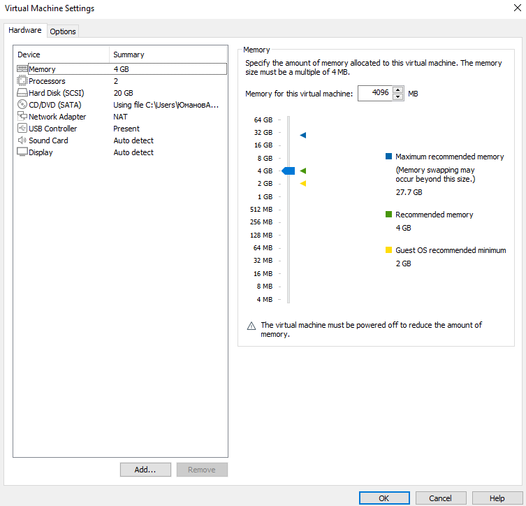
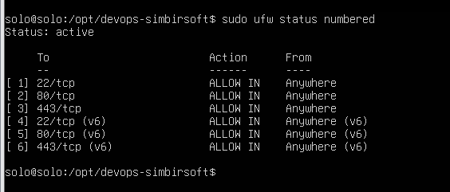
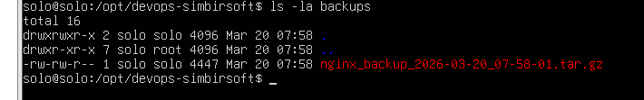
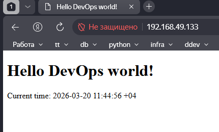
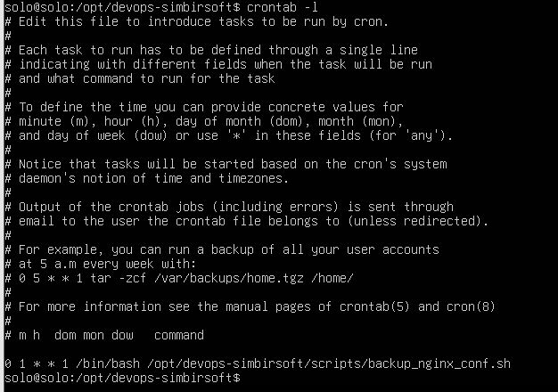

# Отчет по проделанной работе

##### Выполнил Юманов Алексей

##### Отчет коротко
| Таска  | Сделано  | Короткое описание |
|-------|-----| -------------------|
| 1) в виртуальной машине или контейнерной среде с любой ОС Linuxустановить прокси-сервер Nginx версии 1.29.6 | Да  | Ubuntu VM + Docker |
| 2) при открытии страницы сервера на 80 порту в браузере должен выводиться статический текст 'Hello DevOps world!' | Да  | Страница на 80 |
| 3) настроить и установить любой файерволл, чтобы разрешил подключения к серверу на 80 443 и 22 порты, а все остальное блокировал, продемонстрировать | Да  | UFW: 22, 80, 443 |
| 4*) на статической странице выводится время, либо текущее, либо сотставанием от системного не более 1 минуты | Да  | Samara time |
| 5*) при обращении к порту 443 открывается та же страница, но с использованием ssl шифрования (сертификат может бытьсамоподписанным) | Да  | HTTPS + self-signed |
| 6*) бекап настроек nginx в архивах, в имени которых содержится дата создания с точностью до секунды, по расписанию каждый понедельник в 01:00 по UTC | Да  | cron + tar.gz |
| 7*) прокси сервер Nginx сервис должен работать от отдельного пользователя ( не root ) | Да  | USER nginxuser |
| 8*) сгенерируй ssh ключ для доступа к серверу и опиши шаги его использования | Нет  | Не делал |
| 9*) напиши Dockerfile для создания образа nginx с кастомным файлом конфигурации | Да  | Dockerfile + nginx |


#### Теоритическое задание
##### 1. Нужно обеспечить высокую доступность сервиса, как бы ее реализовал?

**Ответ**: есть несколько подходов. Можно использовать балансировщик нагрузки и прописать несколько серверов, которые будут обрабатывать запросы. Также можно использовать кластеризацию и репликацию данных для обеспечения отказоустойчивости. Важно также настроить мониторинг и автоматическое восстановление в случае сбоев.

Пример минимального конф. файла на Nginx:
```nginx
http {
   upstream app{
      server 10.2.0.100;
      server 10.2.0.101;
      server 10.2.0.102;
   }
   ...
}
```

Кластеризация и репликация через Docker Swarm или Kubernetes путем указания количества реплик. Мониторинг можно взять через связку Prometheus + Grafana. Дашборд можно взять из [маркета графаны](https://grafana.com/grafana/dashboards/?pg=docs-grafana-latest-visualizations-dashboards-search-dashboards&search=nginx). Правила писать собственноручно или искать готовые и подбить под свои нужды.

##### 2. Тебе надо создать и настроить 5 таких серверов, как бы это
реализовал?

**Ответ**: оптимальный вариант брать Ansible, Terraform или другой инструмент для автоматизации развертывания. С помощью Ansible можно написать плейбук, который будет устанавливать и настраивать Nginx на каждом сервере. С помощью Terraform можно создать инфраструктуру в облаке и развернуть там сервера с Nginx.

### Описание проекта
За основу взят образ `ubuntu-server:24.04` и VMWare Workstation 17.6.4 Pro.
Внутри него установлены обязательные пререквизиты: `ufw`, `docker`, `docker compose plugin`, `cron`.



### Настройка фаервола
Для настройки фаервола был использован `ufw`. Были открыты порты 80 и 443 для доступа к веб-серверу, а также порт 22 для удаленного доступа по SSH. Остальные порты были закрыты для обеспечения безопасности.


### Бэкап конфигов
Для создания бэкапов конфигурационных файлов был написан скрипт `backup_nginx_conf.sh`, который выполняется в 1:00 по понедельникам с помощью `cron`. Скрипт копирует важные конфигурационные файлы в директорию `/backups` и сохраняет их с отметкой времени с относительным путем.


### Отчет по работе веб-сервера
Для развертывания веб-сервера был использован `docker` и `docker compose plugin`. В результате, веб-сервер успешно обрабатывает запросы и отображает содержимое, что подтверждается скриншотом ниже.


### Настройка cron
Ниже прописан простой крон, сверен путем сайта crontab.guru и предварительно тестировался с помощью * * * * *.



